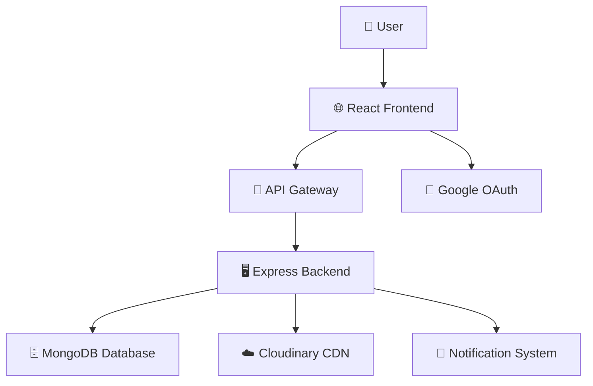
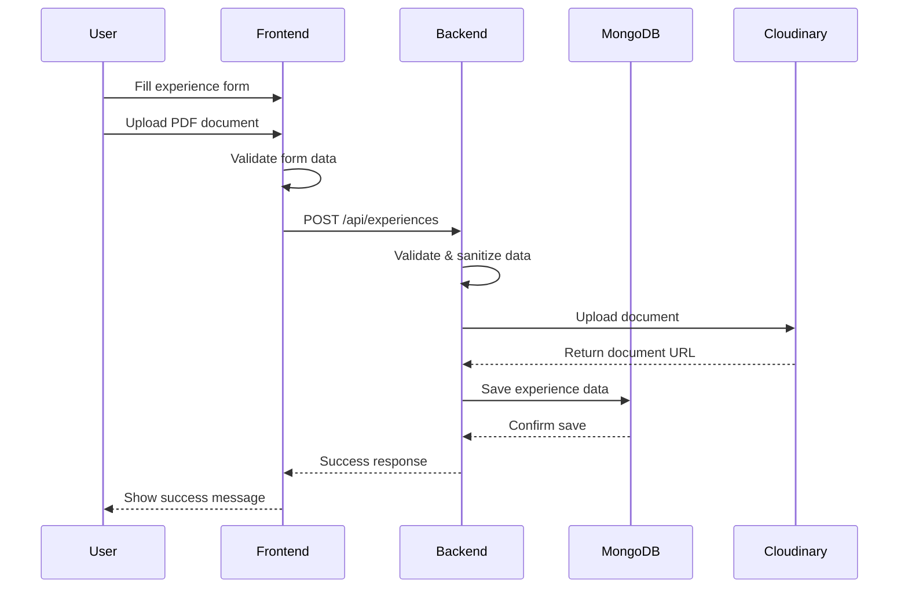
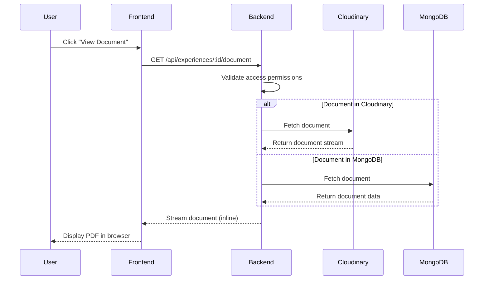
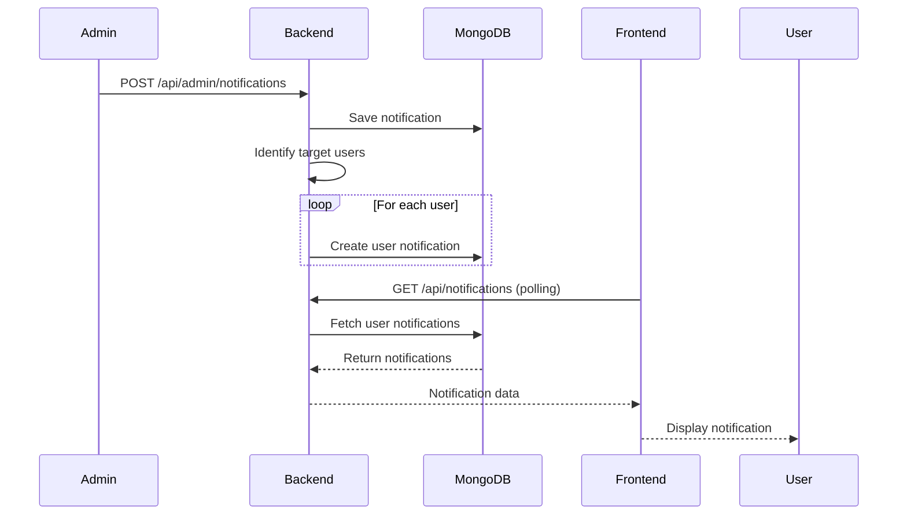

# 🔄 PlacedIn Code Flow & Architecture Guide

> **A comprehensive technical deep-dive into PlacedIn's architecture, data flow, and implementation details**

This document provides a detailed technical walkthrough of the PlacedIn application, covering both frontend and backend architectures. Perfect for developers, contributors, and technical recruiters who want to understand the system's design and implementation.

---

## 🎯 System Overview

PlacedIn is a **full-stack web application** built with modern technologies, designed to handle high-traffic scenarios while maintaining excellent user experience. The application follows a **microservices-inspired architecture** with clear separation of concerns.

### 🏗️ High-Level Architecture



---

## 🎨 Frontend Architecture (React/TypeScript)

### 1. **Application Bootstrap & Entry Point**
```typescript
// src/main.tsx - Application initialization
🚀 ReactDOM.createRoot()
├── StrictMode wrapper for development warnings
├── App component mounting
└── CSS imports and global styles
```

### 2. **Core Application Structure**
```typescript
// src/App.tsx - Main application orchestrator
📱 App Component
├── 🔄 State Management (useState hooks)
│   ├── experiences: Experience[] - Global experience state
│   ├── selectedExperience: Experience | null - Modal state
│   ├── user: GoogleUser | null - Authentication state
│   └── isLoading: boolean - Loading state management
├── 🎣 Side Effects (useEffect hooks)
│   ├── User persistence (localStorage integration)
│   ├── Experience data fetching
│   └── Loading state management
└── 🛣️ Routing Configuration (React Router v6)
    ├── Public routes (/, /experiences)
    ├── Protected routes (/post, /admin)
    └── Route-level code splitting
```

### 3. **Navigation & User Experience**
```typescript
// src/components/Home/Navigation.tsx - Smart navigation system
🧭 Navigation Component
├── 📱 Responsive Design
│   ├── Desktop navigation (horizontal layout)
│   ├── Mobile navigation (hamburger menu)
│   └── Adaptive icon sizing
├── 🔐 Role-Based Menu Items
│   ├── Student routes (Home, Post, Experiences)
│   ├── Admin routes (+Admin Dashboard)
│   └── Dynamic route generation
├── 🎨 Active State Management
│   ├── useLocation hook integration
│   └── Dynamic styling based on current route
└── 👤 User Authentication UI
    ├── Google OAuth integration
    ├── User profile display
    └── Logout functionality
```

### 4. **Home Page & Landing Experience**
```typescript
// src/components/Home/Home.tsx - Engaging landing page
🏠 Home Component
├── 📊 Animated Statistics
│   ├── Counter animations with useEffect
│   ├── Real-time data fetching
│   └── Performance-optimized rendering
├── 🚀 Call-to-Action Sections
│   ├── Primary CTA (Post Experience)
│   ├── Secondary CTA (Browse Experiences)
│   └── Social proof elements
└── 🦶 Enhanced Footer
    ├── Company information
    ├── Privacy & Terms modals
    ├── Team showcase with LinkedIn integration
    └── WhatsApp contact integration
```

### 5. **Experience Management System**
```typescript
// src/components/Experience/ - Core business logic
📝 Experience Management
├── PostExperience_NEW.tsx - Enhanced submission form
│   ├── 📋 Multi-step form validation with SASTRA email verification
│   ├── 📎 File upload with Cloudinary integration
│   ├── 🏢 Smart company selection with autocomplete
│   ├── ⏳ Animated progress bars for email validation
│   └── 🔄 Real-time form state management
├── ExperienceTextEditor.tsx - Advanced rich text editor
│   ├── 🎨 Formatting toolbar (Bold, Italic, Lists, Quotes, Headings)
│   ├── 👁️ Live preview mode with markdown-style rendering
│   ├── ⌨️ Keyboard shortcuts (Ctrl+B, Ctrl+I)
│   ├── 📱 Responsive design for mobile/desktop
│   └── 🌙 Dark mode compatible interface
├── Experiences.tsx - Listing & search
│   ├── 🔍 Advanced filtering system
│   ├── 📱 Responsive grid layout
│   ├── 🎭 Loading states and skeletons
│   └── 📄 Pagination or infinite scroll
├── ExperienceModal.tsx - Detailed view
│   ├── 📋 Full experience details
│   ├── 📄 PDF document viewer
│   ├── 🖼️ Image gallery support
│   └── 📤 Social sharing features
└── CompanySelector.tsx - Autocomplete input
    ├── 🔍 Fuzzy search implementation
    ├── 📊 Company popularity ranking
    └── ➕ Add new company functionality
```

### 6. **Admin Dashboard & Moderation**
```typescript
// src/components/Admin/ - Administrative interface
👨‍💼 Admin System
├── AdminDashboard.tsx - Main admin interface
│   ├── 📊 Real-time statistics dashboard
│   ├── 📋 Experience approval queue
│   ├── 🔍 Advanced search and filtering
│   └── 📈 Analytics and reporting
├── AdminVerification.tsx - Content moderation
│   ├── ✅ Batch approval operations
│   ├── ❌ Rejection with feedback
│   ├── 📝 Content editing capabilities
│   └── 🔍 Detailed review interface
└── NotificationManager.tsx - System notifications
    ├── 📢 Broadcast notifications
    ├── 🎯 Targeted user notifications
    ├── 📅 Scheduled notifications
    └── 📊 Notification analytics
```

### 7. **Authentication & Security**
```typescript
// src/components/GoogleAuth.tsx - OAuth integration
🔐 Authentication System
├── 🌐 Google OAuth 2.0 integration
├── 🔄 Token management and refresh
├── 👤 User profile synchronization
├── 🛡️ Protected route enforcement
└── 💾 Persistent session management
```

### 8. **Real-time Features**
```typescript
// src/hooks/useNotifications.ts - Notification system
🔔 Notification Management
├── 🔄 Real-time notification polling
├── 📱 Browser notification API
├── 🎨 Toast notification system
└── 🗄️ Local notification storage
```

---

## 🖥️ Backend Architecture (Express/Node.js)

### 1. **Server Bootstrap & Configuration**
```javascript
// server/index.js - Express server setup (Enhanced with latest features)
🚀 Express Server
├── 🔧 Middleware Configuration
│   ├── CORS (Cross-Origin Resource Sharing) with environment-specific origins
│   ├── Body parsing (JSON, URL-encoded, multipart) with size limits
│   ├── Static file serving with cache headers
│   ├── Error handling middleware with detailed logging
│   └── Request logging and monitoring
├── 🗄️ Database Connection
│   ├── MongoDB connection with Mongoose (latest ODM features)
│   ├── Connection pooling optimization for high traffic
│   ├── Automatic reconnection handling with retry logic
│   ├── Database health monitoring and alerts
│   └── Optimized indexes for rich text search
├── 🛣️ Route Registration
│   ├── /api/experiences - Enhanced experience management with rich text
│   ├── /api/admin - Administrative functions with improved analytics
│   ├── /api/notifications - Real-time notification system
│   ├── /api/health - Health check endpoints
│   └── File upload routes with Cloudinary integration
└── 🚀 Server Initialization
    ├── Environment-based port configuration
    ├── Graceful shutdown handling
    ├── Process monitoring and error recovery
    └── Performance metrics collection
```

### 2. **Database Layer & Models**
```javascript
// server/models/Experience.js - Data modeling
🗄️ Database Architecture
├── 📋 Experience Schema
│   ├── Basic Info (title, description, company)
│   ├── Student Info (name, year, course)
│   ├── Experience Details (type, duration, CTC)
│   ├── Documents (PDF uploads, links)
│   ├── Metadata (timestamps, approval status)
│   └── Search optimization (text indexes)
├── 🔍 Query Optimization
│   ├── Compound indexes for filtering
│   ├── Text search indexes
│   └── Performance monitoring
└── 🔐 Data Validation
    ├── Mongoose schema validation
    ├── Custom validators
    └── Sanitization middleware
```

### 3. **API Routes & Business Logic**

#### **Experience Management API**
```javascript
// server/routes/experiences.js - Core business logic
📋 Experience Routes
├── GET /api/experiences - List experiences
│   ├── 🔍 Advanced filtering (company, year, type)
│   ├── 📄 Pagination with metadata
│   ├── 🎯 Search functionality
│   └── 📊 Response optimization
├── POST /api/experiences - Create experience
│   ├── 📎 File upload handling (Multer)
│   ├── ☁️ Cloudinary integration
│   ├── 🗄️ MongoDB fallback storage
│   ├── ✅ Data validation and sanitization
│   └── 🔔 Notification triggers
├── GET /api/experiences/:id - Get single experience
│   ├── 📋 Complete experience details
│   ├── 📄 Document access control
│   └── 👁️ View tracking (optional)
└── GET /api/experiences/:id/document - Serve documents
    ├── 📄 PDF inline viewing
    ├── 🔒 Access control validation
    ├── 📊 Analytics tracking
    └── 🚀 CDN optimization
```

#### **Administrative API**
```javascript
// server/routes/admin.js - Admin-only operations
👨‍💼 Admin Routes
├── GET /api/admin/experiences - Admin experience list
│   ├── 📋 All experiences (including pending)
│   ├── 🔍 Advanced admin filters
│   ├── 📊 Bulk operation support
│   └── 📈 Analytics data
├── PUT /api/admin/experiences/:id - Update experience
│   ├── ✅ Approve/reject operations
│   ├── 📝 Content editing
│   ├── 🔄 Status change notifications
│   └── 📋 Admin action logging
├── DELETE /api/admin/experiences/:id - Delete experience
│   ├── 🗑️ Soft delete implementation
│   ├── 📋 Audit trail maintenance
│   └── 🔔 User notifications
└── GET /api/admin/stats - Analytics dashboard
    ├── 📊 Real-time statistics
    ├── 📈 Trend analysis
    ├── 🏢 Company-wise breakdowns
    └── 👥 User engagement metrics
```

#### **Notification System API**
```javascript
// server/routes/notifications.js - Real-time notifications
🔔 Notification Routes
├── GET /api/notifications - Get user notifications
│   ├── 👤 User-specific notifications
│   ├── 📄 Pagination support
│   ├── 🔍 Filter by type/status
│   └── 📊 Unread count
├── POST /api/notifications - Create notification
│   ├── 🎯 Targeted notifications
│   ├── 📢 Broadcast notifications
│   ├── 📅 Scheduled delivery
│   └── 📋 Template system
├── PUT /api/notifications/:id - Update notification
│   ├── ✅ Mark as read
│   ├── 📝 Content updates
│   └── 🎯 Delivery status
└── DELETE /api/notifications/:id - Delete notification
    ├── 🗑️ User-initiated deletion
    ├── 📋 Admin cleanup
    └── 📊 Analytics tracking
```

### 4. **File Upload & Media Management**
```javascript
// Cloudinary Integration - Media optimization
☁️ Media Management
├── 📎 Upload Pipeline
│   ├── File validation (type, size)
│   ├── Virus scanning (optional)
│   ├── Cloudinary upload with transforms
│   └── MongoDB fallback storage
├── 🖼️ Image Processing
│   ├── Automatic format optimization
│   ├── Responsive image generation
│   ├── Quality optimization
│   └── Progressive loading support
└── 📄 Document Handling
    ├── PDF processing and optimization
    ├── Thumbnail generation
    ├── Text extraction for search
    └── Access control implementation
```

### 5. **Security & Performance**
```javascript
// Security & Performance Optimizations
🔒 Security Layer
├── 🛡️ Input Validation
│   ├── Schema-based validation
│   ├── XSS prevention
│   ├── SQL injection protection
│   └── File upload security
├── 🔐 Authentication & Authorization
│   ├── Google OAuth verification
│   ├── JWT token management
│   ├── Role-based access control
│   └── Session management
└── ⚡ Performance Optimization
    ├── Database query optimization
    ├── Response caching strategies
    ├── Image and document optimization
    └── API rate limiting
```

---

## 🔄 Data Flow Diagrams

### 📝 Experience Submission Flow


### 👁️ Document Viewing Flow


### 🔔 Real-time Notification Flow


---

## 🎯 Advanced Features & Implementation

### 🔍 **Smart Search System**
```typescript
// Advanced search implementation
🔍 Search Architecture
├── 🎯 Multi-field Search
│   ├── Company name fuzzy matching
│   ├── Experience content text search
│   ├── Student name search
│   └── Tag-based filtering
├── 📊 Search Optimization
│   ├── Debounced search queries
│   ├── Result caching
│   ├── Search result ranking
│   └── Analytics tracking
└── 🎨 User Experience
    ├── Real-time search suggestions
    ├── Search history
    ├── Saved searches
    └── Filter persistence
```

### 📱 **Progressive Web App Features**
```typescript
// PWA implementation details
📱 PWA Features
├── 🔧 Service Worker
│   ├── Offline functionality
│   ├── Cache management
│   ├── Background sync
│   └── Push notifications
├── 📋 Web App Manifest
│   ├── App icons and branding
│   ├── Display preferences
│   ├── Theme configuration
│   └── Startup behavior
└── 🚀 Performance
    ├── Code splitting
    ├── Lazy loading
    ├── Image optimization
    └── Bundle analysis
```

### 📊 **Analytics & Monitoring**
```typescript
// Comprehensive monitoring system
📊 Analytics System
├── 👤 User Analytics
│   ├── Page view tracking
│   ├── User journey mapping
│   ├── Feature usage statistics
│   └── Performance metrics
├── 🔍 Search Analytics
│   ├── Popular search terms
│   ├── Search success rates
│   ├── Filter usage patterns
│   └── Result click-through
└── 🖥️ System Monitoring
    ├── API response times
    ├── Error tracking
    ├── Database performance
    └── Uptime monitoring
```

---

---

## 🎨 Rich Text Editor System

### 📝 **ExperienceTextEditor Component**
```typescript
// src/components/Experience/ExperienceTextEditor.tsx - Professional text editing
🎨 Rich Text Editor
├── 🛠️ Formatting Toolbar
│   ├── Bold (**text**) with Ctrl+B shortcut
│   ├── Italic (*text*) with Ctrl+I shortcut
│   ├── Bullet lists (• item)
│   ├── Numbered lists (1. item)
│   ├── Blockquotes (> quote)
│   └── Headings (## title)
├── 👁️ Live Preview System
│   ├── Real-time markdown-style rendering
│   ├── Toggle between edit/preview modes
│   ├── HTML sanitization and security
│   └── Responsive preview layout
├── 📱 Responsive Design
│   ├── Mobile-optimized toolbar layout
│   ├── Touch-friendly button sizing
│   ├── Adaptive textarea height
│   └── Collapsible toolbar sections
├── 🌙 Dark Mode Support
│   ├── Theme-aware color schemes
│   ├── Consistent contrast ratios
│   ├── Smooth transition animations
│   └── Icon color adaptations
├── ✅ Smart Validation
│   ├── Real-time character counting
│   ├── Minimum length enforcement (50 chars)
│   ├── Maximum length protection (10,000 chars)
│   ├── Visual feedback indicators
│   └── Error state management
└── 💡 Writing Assistance
    ├── Content structure suggestions
    ├── Formatting help tooltips
    ├── Best practice guidelines
    └── Real-time writing tips
```

### 📧 **Email Validation System**
```typescript
// Enhanced email validation with SASTRA domain checking
📧 Email Validation Flow
├── 🔍 Multi-step Validation Process
│   ├── Step 1: Email format verification
│   ├── Step 2: Domain validation
│   ├── Step 3: SASTRA domain checking (@sastra.ac.in)
│   ├── Step 4: Institutional email confirmation
│   └── Step 5: Validation completion
├── ⏳ Animated Progress Feedback
│   ├── 5-step progress bar (0% → 100%)
│   ├── 300ms delay between steps for smooth UX
│   ├── Real-time progress messages
│   ├── Success/error state animations
│   └── Loading spinner integration
├── 🎯 SASTRA Domain Enforcement
│   ├── Case-insensitive domain checking
│   ├── Automatic rejection of non-SASTRA emails
│   ├── Clear error messages for invalid domains
│   └── Educational guidance for students
└── 🔄 Form Integration
    ├── Real-time validation on submit
    ├── Form state management during validation
    ├── Error recovery mechanisms
    └── User feedback integration
```

### 🎭 **User Experience Enhancements**
```typescript
// Comprehensive UX improvements across the platform
🎭 UX Enhancement System
├── 🎨 Visual Feedback
│   ├── Smooth hover animations on toolbar buttons
│   ├── Focus states with blue border animations
│   ├── Success/error state color transitions
│   ├── Loading skeletons for content areas
│   └── Micro-interactions for user actions
├── ⌨️ Keyboard Accessibility
│   ├── Ctrl+B for bold formatting
│   ├── Ctrl+I for italic formatting
│   ├── Tab navigation through toolbar
│   ├── Enter key for form submission
│   └── Escape key for modal closing
├── 📱 Mobile Optimizations
│   ├── Touch-friendly button sizes (44px min)
│   ├── Responsive toolbar wrapping
│   ├── Mobile-optimized spacing
│   ├── Gesture-friendly interactions
│   └── Adaptive font sizing
└── 🌐 Accessibility Features
    ├── ARIA labels for screen readers
    ├── Semantic HTML structure
    ├── High contrast mode support
    ├── Focus management
    └── Keyboard navigation support
```

---

## 🚀 Performance Optimization Strategies

### ⚡ **Frontend Optimization**
- **Code Splitting**: Route-based and component-based splitting
- **Lazy Loading**: Images, components, and routes
- **Memoization**: React.memo, useMemo, useCallback
- **Bundle Optimization**: Tree shaking, minification
- **Image Optimization**: WebP format, responsive images

### 🖥️ **Backend Optimization**
- **Database Indexing**: Compound indexes for complex queries
- **Query Optimization**: Aggregation pipelines, projection
- **Caching Strategy**: Redis for session and query caching
- **Connection Pooling**: MongoDB connection optimization
- **Response Compression**: Gzip compression for API responses

### ☁️ **Infrastructure Optimization**
- **CDN Integration**: Cloudinary for global content delivery
- **Horizontal Scaling**: Load balancing for high traffic
- **Database Scaling**: MongoDB sharding for large datasets
- **Monitoring**: Real-time performance monitoring
- **Auto-scaling**: Dynamic resource allocation

---

## 🎨 UI/UX Design Principles

### 🎯 **Design System**
- **Consistent Branding**: SASTRA University colors and typography
- **Accessibility**: WCAG 2.1 AA compliance
- **Responsive Design**: Mobile-first approach
- **Interactive Elements**: Hover states, animations, micro-interactions
- **Loading States**: Skeleton screens, progress indicators

### 📱 **Mobile Experience**
- **Touch-Friendly**: Optimized for touch interactions
- **Performance**: Optimized for mobile networks
- **Navigation**: Simplified mobile navigation
- **Forms**: Mobile-optimized form inputs
- **Offline Support**: Basic offline functionality

---

## 🔧 Development Workflow

### 🛠️ **Code Quality**
```bash
# Development standards
├── TypeScript strict mode
├── ESLint + Prettier configuration
├── Husky pre-commit hooks
├── Jest unit testing
├── Cypress e2e testing
└── Conventional commit messages
```

### 🚀 **CI/CD Pipeline**
```bash
# Automated deployment
├── GitHub Actions workflows
├── Automated testing
├── Build optimization
├── Deployment to Netlify/Render
└── Environment management
```

---

*For additional technical details, refer to the inline code comments and API documentation.*
